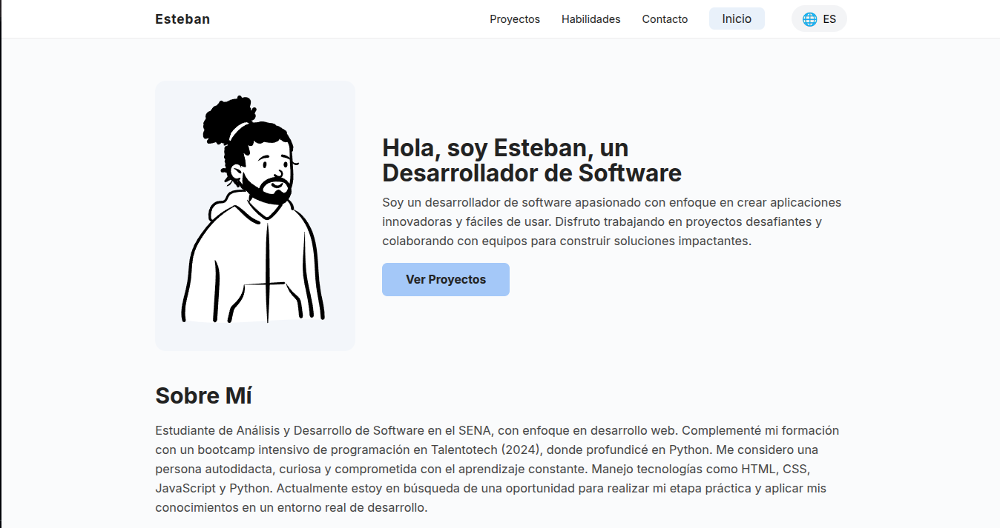

# Portafolio Web de Esteban

---

  

<h2 align="center">Bienvenido a mi portafolio personal 👋</h2>

Este es mi espacio en la web donde comparto mis proyectos, habilidades y formas de contacto. El diseño es **minimalista**, **responsivo** y está optimizado para dispositivos móviles.

---

## ✨ Características

- Diseño limpio y profesional
- 100% responsivo (desktop, tablet y mobile)
- Cambio de idioma (ES/EN)
- Sección de proyectos, habilidades y contacto
- Menú lateral mobile animado

---

## 🛠️ Tecnologías utilizadas

- **HTML5**
- **CSS3** (con media queries y técnicas modernas)
- **JavaScript** (sin frameworks)

---

## 🌐 Demo en vivo

[🔗 Ver portafolio online](https://estebandev.me)

---

## 📸 Preview

  

---

## 📬 Contacto y redes

- [LinkedIn](https://www.linkedin.com/in/estebanb-dev/)
- [GitHub](https://github.com/xEstebaan)

---

Desarrollado con ❤️ por **Esteban**

